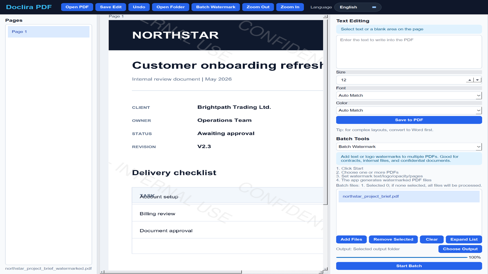

# Doclira PDF

**Practical PDF tools for Windows: edit short text, batch watermark, convert and organize documents locally.**

[Official Website](https://www.doclira.com/) | [Free Lite Edition](https://github.com/lienowen/doclira-pdf-lite) | [Purchase on Gumroad](https://taixianglumark.gumroad.com/l/doclira-pdf) | [User Guide](https://www.doclira.com/guide/)



## Website Source

Static Astro product site for **Doclira PDF**. It contains:

- English landing page at `/`
- Chinese landing page at `/zh/`
- English user guide at `/guide/`
- Chinese user guide at `/zh/guide/`
- English support, privacy and refund policy pages
- Chinese support, privacy and refund policy pages
- Lite versus Pro comparison linked to the public Lite repository
- Actual desktop application screenshots and an English walkthrough video under `public/media/`
- Product output comparisons under `public/assets/`

## Local Development

```powershell
npm install
npm run dev
```

## Build

```powershell
npm run build
```

Deploy the generated Astro site to Vercel. Current launch settings in `src/brand.js`:

- `purchaseUrl`: `https://taixianglumark.gumroad.com/l/doclira-pdf`
- `liteUrl`: `https://github.com/lienowen/doclira-pdf-lite`
- `supportEmail`: `taixianglumark@gmail.com`

The public website intentionally states the product limitations: Doclira PDF handles common local PDF work and lightweight text changes, but it is not advertised as full Word-style editing for every complex or scanned PDF.
